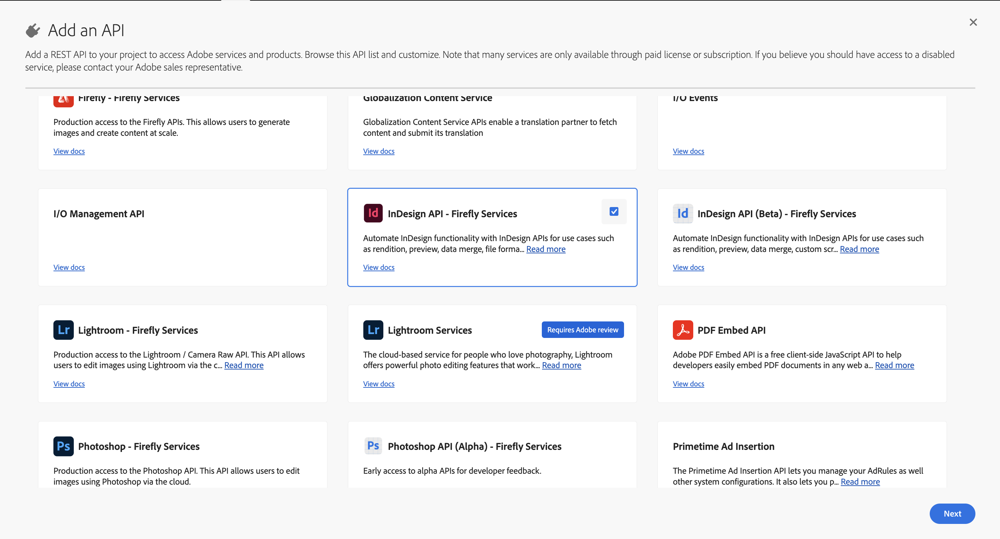

# Authentication for InDesign API

Set up your project and authenticate to use the InDesign API.

## Adobe Developer Console

Authentication for InDesign API is handled through the Adobe Developer Console.

The **Adobe Developer Console** is an administration interface that
enables developers to manage Adobe's APIs and services. To securely
access Adobe's APIs, including the InDesign API, your application must
authenticate using OAuth 2.0 protocols. This involves obtaining an
access token that grants your application permissions to interact with
Adobe's services.

**You will need:**

- An [Adobe Developer Console][1] account.

- A [project][2] with Firefly API [OAuth Server-to-Server credentials set
  up][3].

- Add and configure **InDesign API Firefly Services** to your new project.

- Access to your Client ID and Client Secret from the Developer Console.

### Access tokens

You can [generate access tokens][4] either directly from the Developer Console UI or programmatically.

### Best practices

- **Token management:** Access tokens are valid for 24 hours. Implement a mechanism to refresh tokens before they expire to maintain uninterrupted access.

- **Scope limitation:** Request only the scopes necessary for your
  application's functionality to adhere to the principle of least
  privilege.

- **Secure storage:** Store your Client ID, Client Secret, and access tokens securely to prevent unauthorized access.

<!-- Links -->
[1]: https://developer.adobe.com/
[2]: https://developer.adobe.com/developer-console/docs/guides/projects/projects-empty/
[3]: https://developer.adobe.com/developer-console/docs/guides/services/services-add-api-oauth-s2s/
[4]: https://developer.adobe.com/developer-console/docs/guides/services/services-add-api-oauth-s2s/#api-overview
