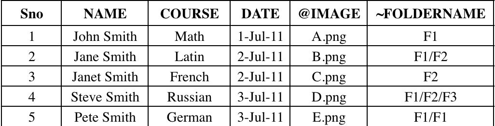
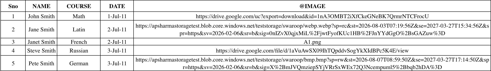

# Working with Advanced Data Merge API

This guide covers advanced techniques for the [Data Merge API](../../api/index.md), building on the basics from [Working with the Data Merge API](../working-with-datamerge-api/index.md), including conditional visibility, dynamic styling, copyfitting, zip output and pre-signed URL support in CSV.

## Conditional Visibility & Dynamic Styling

Make your Data Merge output react to your data. With a simple rules file, you can show or hide elements, restyle and recolor content, replace text, and resize or move frames — differently for every record — all from a single template and data file.

### Overview

Traditionally, Data Merge drops the text or image from each record into fixed placeholders in your template. The layout stays the same for everyone — only the placeholder content changes.

This feature adds a third input to a merge job: a rules file (JSON) that travels alongside your template and data.

```
Template (.indd / .idml) + Data (.csv) + Rules (.json) → Output (INDD / PDF / PNG / JPEG)
```

For each record, the merge reads your rules and applies whichever actions match that record's data. The result is one job that produces genuinely different-looking documents per record — a VIP badge that appears only for VIP customers, a price that turns red when it exceeds a threshold, a promo layer that shows only for high-spend recipients, and so on.

The feature is fully optional and backward compatible: if you don't provide a rules file, your merge behaves exactly as it does today.

### What you can do

| Capability | Description |
|---|---|
| Conditional visibility | Show or hide a layer, a frame, or a placeholder per record. |
| Dynamic styling | Apply a named character or paragraph style, or change fill/stroke color, per record. |
| Content replacement | Replace the text of a placeholder or tagged text range per record. |
| Geometry | Resize or move a frame per record. |
| Business logic | Combine conditions with AND / OR / NOT, ranges, and text matching to decide what happens. |

All decisions are driven by the values in your CSV columns.

### Getting started

1. **Author your template** as you normally would for Data Merge, including your placeholders. Give the elements you want to control a name you can reference — a dataMerge placeholder name, an XML tag, or a layer name (see [Targets](#targets--what-a-rule-acts-on)).
2. **Prepare your CSV** as usual. Any column you want to test in a rule must exist in the CSV — even if that column isn't placed anywhere in the template.
3. **Write a rules file** (a `.json` file) describing your conditions and actions (see below).
4. **Submit the merge job** with the new `rulesFile` parameter pointing at your rules file:

```json
{
  "params": {
    "targetDocument": "template.indd",
    "dataSource": "data.csv",
    "rulesFile": "rules.json",
    "outputMediaType": "application/pdf"
  }
}
```

If `rulesFile` is omitted, the merge runs exactly as a standard Data Merge with no rules applied.

### The rules file

A rules file is a JSON document. At the top level it contains an optional `ruleSetName`, an optional `version`, and a list of **rules**.

```json
{
  "version": "1.0",
  "ruleSetName": "Campaign",
  "rules": [
    {
      "cases": [
        {
          "condition": {},
          "then": [
            { "target": {}, "actions": [] }
          ]
        }
      ],
      "default": {
        "then": [ { "target": {}, "actions": [] } ]
      }
    }
  ]
}
```

- `version` — optional, defaults to the current version.
- `ruleSetName` — optional, a label shown in logs/reports.
- `rules` — required, one or more rules. Each rule contains an ordered list of `cases`. Each case has a `condition` (when this is true...) and a `then` list (...do this). A rule can also define a `default`, which runs only if no case matched.

#### How a rule is evaluated, per record

- Each rule contains an ordered list of **cases**. The engine tests each case's `condition` in order and runs the **first** one that is true — then stops looking at the remaining cases in that rule.
- If **no** case matches and a `default` is present, the `default` runs. If there's no `default`, the rule simply does nothing for that record.
- **At most one** case (or the default) fires per rule.

**Multiple rules:** you can list several rules. Every rule is evaluated for every record, in order. Rules are **cumulative** — more than one can fire for the same record. Use `cases`/`default` when you want a single "pick one" outcome; use separate rules for independent effects that can happen together. If two rules change the *same* property of the *same* target, the **last one wins**.

Each entry in a `then` list is a **clause**: one `target` plus an ordered list of `actions` to run on it.

### Targets — what a rule acts on

A target selects the object(s) an action runs on. It always resolves within the current record's page(s).

| type | Selects by | Acts on |
|---|---|---|
| `layer` | Layer name | The items on that layer |
| `xml_tag` | XML tag name | A frame or a tagged text range |
| `data_merge_tag` | Placeholder name | A Data Merge placeholder (image, QR, or text) |

```json
{ "type": "layer", "name": "premium_offer" }
```

#### Referencing a Data Merge placeholder by kind

A `data_merge_tag` target chooses which kind of placeholder to act on using a name prefix:

| Prefix | Kind | Example |
|---|---|---|
| `@` | Image placeholder | `"@hero"` → the image placeholder named `hero` |
| `#` | QR-code placeholder | `"#ticket"` → the QR placeholder named `ticket` |
| (none) | Text placeholder | `"title"` → the text placeholder named `title` |

```json
{ "type": "data_merge_tag", "name": "@hero" }
```

### Actions — what a rule does

Each clause runs an ordered list of actions on its target. Actions apply top-to-bottom; a later action overrides an earlier one on the same target.

| Action `name` | Parameters | Effect |
|---|---|---|
| `show` | — | Make the target visible |
| `hide` | — | Make the target hidden |
| `replace_text` | `value` (string) | Replace the text content |
| `set_character_style` | `styleName` (string) | Apply a named character style |
| `set_paragraph_style` | `styleName` (string) | Apply a named paragraph style |
| `set_fill_color` | `color` (hex `#RRGGBB` or swatch name) | Change the fill color |
| `set_stroke_color` | `color` (hex `#RRGGBB` or swatch name) | Change the stroke color |
| `resize_frame` | `width`, `height` | Resize the frame |
| `move_frame` | `x`, `y` | Move the frame's top-left origin |

```json
{ "name": "set_fill_color", "color": "#D4AF37" }
```

**Notes**

- **Styles and swatches must already exist** in your template. A rule can apply a named style or swatch, but it cannot create one. Referencing a hex color like `#D4AF37` is always fine.
- For `resize_frame`, values must be **non-negative**. Passing `0` for `width` or `height` leaves **that axis unchanged**.
- `resize_frame` and `move_frame` apply to frames only.

#### Which actions work on which targets

| Action \ Target | `layer` | `xml_tag` | `data_merge_tag` |
|---|---|---|---|
| `show` / `hide` | ✓ | ✓ | ✓ |
| `replace_text` | — | ✓ | ✓ |
| `set_character_style` | — | ✓ | ✓ |
| `set_paragraph_style` | — | ✓ | ✓ |
| `set_fill_color` | — | ✓ | ✓ |
| `set_stroke_color` | — | ✓ | ✓ |
| `resize_frame` | — | ✓ | ✓ |
| `move_frame` | — | ✓ | ✓ |

Using an action on a target that isn't marked ✓ is rejected when your rules file is checked (see [Errors & Warnings](#errors--warnings)).

### Conditions — deciding when a rule applies

A condition is a small JSON structure — never a text expression to be parsed — so column names with spaces or punctuation (e.g. `Life Time Spend`) are written verbatim with no escaping.

There are three building blocks:

- **Comparison** (a single test on one column)
- **Group** (`all` = AND, `any` = OR)
- **Not** (negates any condition)

#### Comparison

```json
{
  "column": "Life Time Spend",
  "operator": ">",
  "value": 10000,
  "valueColumn": "cost",
  "type": "number"
}
```

- `column` — required, the CSV column to test.
- `operator` — required, see the operator list below.
- `value` — the value to compare against, **or**
- `valueColumn` — another column (use exactly one of `value` / `valueColumn`).
- `type` — optional, force `number` | `string` | `boolean` comparison.

**Operators**

| Group | Operators | Notes |
|---|---|---|
| Comparison | `==`, `!=`, `>`, `>=`, `<`, `<=` | `>`, `>=`, `<`, `<=` are for numbers (or text, alphabetically) — not booleans |
| Set membership | `in`, `not_in` | `value` must be a non-empty array; `valueColumn` not allowed |
| Text matching | `contains`, `starts_with`, `ends_with` | String only, case-sensitive |

**Right-hand side:** provide exactly one of:

- `value` — a literal number, string, or boolean (or an array of literals for `in`/`not_in`), or
- `valueColumn` — the name of another CSV column, to compare column-against-column.

**Value types & how comparisons are made**

- Add `"type": "number"`, `"string"`, or `"boolean"` to force how both sides are compared. If you omit `type`, the type is inferred (a numeric or boolean literal makes the comparison numeric or boolean; otherwise text).
- **Numbers** must be plain decimals (an optional leading `-` is fine). Thousands separators, currency symbols, and locale decimal commas are **not** recognized — `"10,000"`, `"$10,000"`, and `"1.000,50"` will not parse as numbers. If a value can't be parsed as the required type, that comparison is treated as **false** (it won't stop your job).
- **Booleans** accept only `true`/`false` (any case). Anything else is treated as false.
- **Text** comparisons and text-matching operators are **case-sensitive**. Leading/trailing spaces are trimmed before comparing.

#### Group — `all` (AND) and `any` (OR)

```json
{ "all": [] }
{ "any": [] }
```

Groups can nest to any depth, and their children can be comparisons, other groups, or `not` blocks.

#### Not (flipping condition)

Wrap any single condition to negate it:

```json
{ "not": { "column": "sku", "operator": "contains", "value": "PROMO" } }
```

This reads as "SKU does not contain PROMO." (For simple "is not one of a set" tests, the `not_in` operator is usually simpler.)

#### Condition examples

`tier` is `VIP`:

```json
{ "column": "tier", "operator": "==", "value": "VIP" }
```

`Life Time Spend` greater than `10000`:

```json
{ "column": "Life Time Spend", "operator": ">", "value": 10000, "type": "number" }
```

Compare two columns — `Life Time Spend` greater than `cost`:

```json
{ "column": "Life Time Spend", "operator": ">", "valueColumn": "cost", "type": "number" }
```

`tier` is `VIP` AND `spend` over `10000`:

```json
{
  "all": [
    { "column": "tier", "operator": "==", "value": "VIP" },
    { "column": "spend", "operator": ">", "value": 10000, "type": "number" }
  ]
}
```

`region` is not EU or UK:

```json
{ "column": "region", "operator": "not_in", "value": ["EU", "UK"] }
```

A nested example — VIP, in the US or UK, and not blocked:

```json
{
  "all": [
    { "column": "tier", "operator": "==", "value": "VIP" },
    { "any": [
      { "column": "country", "operator": "==", "value": "US" },
      { "column": "country", "operator": "==", "value": "UK" }
    ] },
    { "not": { "column": "status", "operator": "==", "value": "Blocked" } }
  ]
}
```

### Worked examples

#### Example 1 — Show a VIP badge only for VIP records

```json
{
  "ruleSetName": "VIP Badge Display",
  "rules": [
    {
      "cases": [
        {
          "condition": { "column": "tier", "operator": "==", "value": "VIP" },
          "then": [
            { "target": { "type": "data_merge_tag", "name": "vip_badge" },
              "actions": [ { "name": "show" } ] }
          ]
        }
      ],
      "default": {
        "then": [
          { "target": { "type": "data_merge_tag", "name": "vip_badge" },
            "actions": [ { "name": "hide" } ] }
        ]
      }
    }
  ]
}
```

VIP records show the badge; everyone else hides it.

#### Example 2 — Color a badge by tier (first match wins)

```json
{
  "ruleSetName": "Badge tier",
  "rules": [
    {
      "cases": [
        { "condition": { "column": "tier", "operator": "==", "value": "VIP" },
          "then": [ { "target": { "type": "data_merge_tag", "name": "badge" },
                      "actions": [ { "name": "set_fill_color", "color": "#D4AF37" } ] } ] },

        { "condition": { "column": "spend", "operator": ">", "value": 10000, "type": "number" },
          "then": [ { "target": { "type": "data_merge_tag", "name": "badge" },
                      "actions": [ { "name": "set_fill_color", "color": "#C0C0C0" } ] } ] },

        { "condition": { "column": "spend", "operator": ">", "value": 1000, "type": "number" },
          "then": [ { "target": { "type": "data_merge_tag", "name": "badge" },
                      "actions": [ { "name": "set_fill_color", "color": "#CD7F32" } ] } ] }
      ],
      "default": {
        "then": [ { "target": { "type": "data_merge_tag", "name": "badge" },
                    "actions": [ { "name": "hide" } ] } ]
      }
    }
  ]
}
```

Reads as: VIP → gold; else if spend > 10,000 → silver; else if spend > 1,000 → bronze; otherwise hide the badge. Cases are tested top-to-bottom and only the first match applies.

#### Example 3 — Reveal a promo layer for high-spend records

```json
{
  "ruleSetName": "Premium Offer",
  "rules": [
    {
      "cases": [
        {
          "condition": { "column": "lifetime_spend", "operator": ">", "value": 10000, "type": "number" },
          "then": [
            { "target": { "type": "layer", "name": "premium_offer" },
              "actions": [ { "name": "show" } ] }
          ]
        }
      ]
    }
  ]
}
```

This assumes the `premium_offer` layer is **hidden** in the template. It stays hidden by default and is shown only for records that match. If the layer were visible in the template instead, add a `default` with a `hide` action to switch it off for non-matching records.

#### Example 4 — Swap disclaimer text by region using an `xml_tag`

```json
{
  "ruleSetName": "Regional Disclaimer",
  "rules": [
    {
      "cases": [
        {
          "condition": { "column": "region", "operator": "==", "value": "EU" },
          "then": [
            { "target": { "type": "xml_tag", "name": "disclaimer" },
              "actions": [
                { "name": "replace_text", "value": "This offer is subject to EU consumer protection regulations." },
                { "name": "set_character_style", "styleName": "Legal-EU" }
              ] }
          ]
        },
        {
          "condition": { "column": "region", "operator": "==", "value": "US" },
          "then": [
            { "target": { "type": "xml_tag", "name": "disclaimer" },
              "actions": [
                { "name": "replace_text", "value": "Void where prohibited. See terms for details." },
                { "name": "set_character_style", "styleName": "Legal-US" }
              ] }
          ]
        }
      ],
      "default": {
        "then": [
          { "target": { "type": "xml_tag", "name": "disclaimer" },
            "actions": [ { "name": "replace_text", "value": "Terms and conditions apply." } ] }
        ]
      }
    }
  ]
}
```

This targets the text range tagged `disclaimer` in the template. EU records get EU-specific wording and legal styling, US records get US-specific wording and styling, and every other region falls back to the generic disclaimer text in the `default` case.

### Constraints

- **Single record per page.** Rules are supported only when each page corresponds to one record — the standard Data Merge layout. Jobs configured for multiple records per page are not supported with rules and will be rejected before processing.
- **Columns must exist.** A rule can only reference CSV columns that are present in your data file. A missing column is reported when your rules file is checked.
- **Styles and swatches must exist** in the template before the merge; rules apply them but do not create them.
- **Layer visibility for non-layer targets.** An element renders only if its layer is visible. If you target a placeholder or XML tag that sits on a layer you authored as *hidden*, a `show` action will not make it appear — put rule-driven elements on a visible layer, or target the layer itself.
- **Record ranges.** Contiguous, ascending record ranges (for example `1-50`) are fully supported. Out-of-order or overlapping comma-separated ranges may be restricted; use ascending ranges for rule-driven jobs.
- **Numeric formatting.** Keep numeric columns as plain numbers (no currency symbols, thousands separators, or locale decimals) so numeric comparisons behave as expected.

### Errors & Warnings

The feature distinguishes two kinds of problems:

**Problems that stop the job** (checked up front, before any output is produced). These are things that are wrong with the job setup or the rules file itself, so the whole job is rejected with a clear message and nothing is produced. Examples:

- the rules file is missing, unreadable, or not valid JSON;
- an empty rules list;
- a malformed condition, or a rule/case that isn't shaped correctly;
- a condition that references a column not in the CSV;
- an invalid target type or action, or an action used on a target it doesn't support;
- a rules job submitted with a multiple-records-per-page layout.

Fixing these means correcting the rules file (or the job configuration) and resubmitting.

**Problems that are reported but don't stop the job** (per record). These are situations the engine can safely work around, so the batch continues and the issues are collected in the job's warnings:

- a target name that can't be found for a record;
- a style or swatch named in an action that doesn't exist;
- an action that can't apply to the resolved object (for example, resizing something that isn't a frame);
- a value that can't be read as the required number or boolean — that single comparison is treated as false.

Review the warnings after a run to catch typos in names or unexpected data.

## Copyfitting

The Data Merge API can automatically resize text that overflows its frame after a merge. When a merged record produces overset text, copyfitting reduces the font size - within limits you define - so that the text fits. Copyfitting runs only when you enable it and only when the merged document has overset present.

### Example use cases

Copyfitting is most useful when the length of merged content varies and cannot be predicted at design time:

- **Multi-language data merge:** A single template is merged with a data source that contains rows in different languages, or a template designed for one language is merged with data that includes others. Translations in longer languages (for example, German or Finnish) often overflow frames sized for the original language. Copyfitting shrinks only the overset rows so each language fits, without redesigning the template or hand-editing records.

- **Variable-length content at scale:** In catalogues, price lists, or personalized mailers, fields such as product names, descriptions, or addresses vary in length across thousands of records, and some overflow their frames. Copyfitting fits them automatically so more records export cleanly in a single job.

### How it works

Add a copyfittingSettings object inside params. It accepts the following fields:

- **enabled**
  - **Type:** boolean
  - **Default:** `false`
  - **Description:** Master on/off switch. Copyfitting runs only when set to `true`. If it is `false`, absent, or the whole `copyfittingSettings` block is omitted, copyfitting is off.
- **unresolvedOversetHandling**
  - **Type:** string (enum)
  - **Enum:** `"warn"`, `"omit_records"`
  - **Default:** `"warn"`
  - **Description:** What to do when text is still overset after copyfitting. See [Unresolved overset handling](#unresolved-overset-handling) below.
- **multiFrameSyncScope**
  - **Type:** string (enum)
  - **Enum:** `"paragraph_style"`, `"page"`, `"paragraph_style_and_page"`, `"document"`
  - **Default:** none — omit the key to skip multi-frame sync
  - **Description:** After fitting the overset frames, apply the same font-size reduction to matching non-overset frames for visual consistency. See [Multi-frame sync scopes](#multi-frame-sync-scopes) below.
- **scope.global.constraints.fontSize**
  - **Type:** object with a numeric `minPercent` field
  - **Default:** `minPercent` 85
  - **Description:** Limits for font-size reduction, applied to all text in overset stories. `minPercent` is the floor (text never shrinks below this percentage of its original size; 100 means it never shrinks). Must be between 1 and 100; an out-of-range value fails the job.

Copyfitting is applied after the merge, before export, once per output document. Threaded text across multiple frames is treated as a single story.

### Example request

Enable copyfitting by adding copyfittingSettings to params:

```curl
curl --location --request POST https://indesign.adobe.io/v4/merge-data \
--header "Authorization: Bearer {YOUR_OAUTH_TOKEN}" \
--header "x-api-key: {YOUR_API_KEY}" \
--header "Content-Type: application/json" \
--data-raw '{
"assets": [
   {
      "source": {
        "url": "{PRE-SIGNED_URL}",
        "storageType": "Azure"
      },
      "destination": "dataMergeTemplate.indd"
    },
    {
      "source": {
        "url": "{PRE-SIGNED_URL}",
        "storageType": "Azure"
      },
      "destination": "FileNames.csv"
    }
],
"params": {
 "targetDocument": "dataMergeTemplate.indd",
 "outputMediaType": "application/pdf",
 "outputFolderPath":  {OUTPUT_FOLDER_PATH},
 "outputFileBaseString": "merged",
 "dataSource": "FileNames.csv",
 "recordRange": "All",
 "copyfittingSettings": {
    "enabled": true,
    "unresolvedOversetHandling": "warn",
    "multiFrameSyncScope": "paragraph_style_and_page",
    "scope": {
      "global": {
        "constraints": {
          "fontSize": { "minPercent": 80}
        }
      }
    }
  }
}
}'
```

To enable copyfitting with default limits, `copyfittingSettings` can be as small as setting `enabled` to `true` and omitting the rest.

### Multi-frame sync scopes

Multi-frame sync keeps related frames visually consistent by extending a reduction beyond just the overset frame. Only the font-size **reduction** by percentage is synced (not the absolute point size, and no other property). Omit multiFrameSyncScope to skip sync entirely - only the overset frames change. When present, it must be one of the following.

- **paragraph_style** - Frames whose text uses the same paragraph style, across all pages, receive the largest reduction required by any of them.
  - Example: A "Headline" paragraph style is used in frames throughout the document. If one headline must shrink 12 percent to fit, every frame using the "Headline" style - on every page - is reduced by 12 percent, so all headlines stay consistent.

- **page** - Every text frame on the same page as an overset frame receives the same reduction; paragraph style is ignored.
  - Example: On a product page, the description frame oversets and shrinks 10 percent. The other text frames on that page (title, price, footnote) are also reduced by 10 percent, keeping the page uniform.

- **paragraph_style_and_page** - Like paragraph_style, but limited to the current page: only same-style frames on the same page are matched.
  - Example: Two "Callout" frames on page 3 shrink together, but "Callout" frames on page 4 are unaffected.

- **document** - Every text frame in the entire document receives the same reduction; paragraph style is ignored.
  - Example: If any frame anywhere needs a 15 percent reduction to fit, all text frames across all pages are reduced by 15 percent, giving the whole piece one consistent size.

**Conflict rule:** when frames in a group would need different reductions, the largest (most aggressive) reduction wins for the group, subject to the global minimum — no text shrinks below minPercent of its original size.

### Unresolved overset handling

If text is still overset after copyfitting has reduced text to minPercent of its original size, unresolvedOversetHandling controls the outcome:

- **"warn"** (default) - the output file is still produced; affected records report warnings.oversetText.

- **"omit_records"** - pages for the affected data records are removed from the output and the remaining records still export; affected records report warnings.omittedDataRecordNumbers (and not warnings.oversetText). If every record in the batch would be removed, no file is exported (outputs is empty) and omittedDataRecordNumbers lists the full range.

### Copyfitting in the response

Copyfitting adds no new top-level response field. Results appear per record, inside the existing warnings object.

Still overset with "warn":
```json
"warnings": {
 "oversetText": [
   { "page": "2",
     "charactersInOverset": "142",
     "wordsInOverset": "24",
     "oversetText": "...overflowing text..."
    }
 ]
}
```
Records omitted with "omit_records":
```json
"warnings": { "omittedDataRecordNumbers": "5,6" }
```
If copyfitting hits a script or engine error, the whole job fails (no output for that job):

```json
{
"status": "FAILURE",
"errorCode": "capability_error",
"errorString": "Capability error: Copyfitting failed. <detail>"
}
```

## Folder Structure and Zipped Output

The Data Merge API supports organizing your outputs in a structured folder hierarchy, and a zipped folder containing all the outputs that have been created from the successful data merge.

How it works

- Add a dedicated column in your input CSV for folder names.
- Prefix the column header with ~ (for example: ~FolderName).
- Each row value in this column will be used as the folder hierarchy for the output file of that record.
- Users can opt in for zipped output by setting `outputCompressMediaType`; only `ZIP` is supported for now.
- Add three input parameters:
  - **outputCompressMediaType**
    - **Type:** String
    - **ENUM:** ["application/zip"]
    - **Meaning:** The type of compression the user wants (e.g. ZIP, RAR, etc.).
    - If the user opts for zipped output, the response contains only the zipped output, not individual assets and their links.
    - If the user does not opt for zipped output, the response is unchanged except that the output path reflects the desired folder hierarchy.
  - **outputCompressName**
    - **Type:** String
    - **Default:** `"Result"`
    - **Meaning:** Use this value to name the resulting zip.
  - **outputFolderBaseString**
    - **Type:** String
    - **Default:** `mergedFiles`
    - **Meaning:** Specifies which folder merged files go into and the name of the merged folder; multi-record output files or outputs from empty CSV column values are placed in this folder.

Note:
- Only one folder name column is allowed. If multiple columns have a ‘~’ prefix, the job will fail.
- Local or absolute paths (for example, `C:\F1\F2`) are not supported in the `~` column. Provide relative folder hierarchy values (for example, `F1` or `F1\F2`) only. The job will fail if a row uses a local or absolute path.

### Folder Name Constraints

Certain special characters or words are not supported by the platform and are automatically normalized.

- Consecutive unsupported characters (e.g., &lt;, &gt;, :, ", /, \, |, ?, *) are replaced with a single underscore (e.g., `Ab5<>;d` → `Ab5_d`)
- Windows reserved names (e.g., CON, PRN, AUX, NUL as well as device names like COM1–COM9 and LPT1–LPT9) are wrapped with underscores (e.g., `CON` → `_CON_`)
- File names (including extension) are limited to 255 characters, with longer names truncated automatically

Here is a sample CSV file demonstrating a column header with prefix ‘~’.


Example of input payload which is same as it is currently.

```curl
curl --location --request POST 'https://indesign.adobe.io/v4/merge-data' \
--header 'Authorization: Bearer {YOUR_OAUTH_TOKEN}' \
--header 'x-api-key: {YOUR_API_KEY}' \
--header 'Content-Type: application/json' \
--data-raw '{
  "assets": [
    {
      "source": {
        "url": "{PRE-SIGNED_URL}",
        "storageType": "Azure"
      },
      "destination": "dataMergeTemplate.indd"
    },
    {
      "source": {
        "url": "{PRE-SIGNED_URL}",
        "storageType": "Azure"
      },
      "destination": "FolderNames.csv"
    }
  ],
  "params": {
    "targetDocument": "dataMergeTemplate.indd",
    "outputMediaType": "image/png",
    "outputFolderPath": {OUTPUT_FOLDER_PATH},
    "outputFileBaseString": "merged",
    "dataSource": "FolderNames.csv",
    "recordRange": "All",
    "outputCompressMediaType": "application/zip",
    "outputCompressName": "Works only if outputCompressMediaType is provided",
    "outputFolderBaseString": "Merged folder name; multi-record outputs and empty ~ values go here. Default: mergedFiles",
    "hyphenationSettings": {
      "afterFirst": 3,
      "beforeLast": 3,
      "wordsLongerThan": 6,
      "ladderLimit": 2,
      "zone": 0.15,
      "capitalizedWords": false,
      "lastWord": true,
      "acrossColumns": false,
      "dictionarySettings": [
        {
          "language": "English: USA",
          "wordList": ["~word1", "ex~word2"]
        },
        {
          "language": "English: UK",
          "wordList": ["~word3", "~word4"]
        }
      ]
    }
  },
  "outputs": [
    {
      "destination": {
        "url": "{PUT-SIGNED_URL}"
      },
      "source": "{OUTPUT_FOLDER_PATH}/{outputs}"
    }
  ]
}'
```

### When folder structuring is not supported, and output files will move to ‘outputFolderBaseString’
| outputMediaType                   | params |
|----------------------------------|--------|
| JPEG (image/jpeg)                | allowMultipleRecordsPerPage set to true |
| PNG (image/png)                  | allowMultipleRecordsPerPage set to true |
| PDF (application/pdf)            | recordsPerFile ≠ 1 and recordRange = "All" |
|                                  | recordsPerFile ≠ 1 and recordRange = "1-2, 5" |
|                                  | allowMultipleRecordsPerPage set to true |
| InDesign (application/x-indesign)| recordsPerFile ≠ 1 and recordRange = "All" |
|                                  | recordsPerFile ≠ 1 and recordRange = "1-2, 5" |
|                                  | allowMultipleRecordsPerPage set to true |

**Why:** Folder structuring via the `~` column applies only when the merge job has a clear one-to-one mapping between each data row and its output. In that case, each row’s `~` value defines the folder hierarchy for that record’s output file. If `allowMultipleRecordsPerPage` is true, multiple records can share a page, so per-row folder paths are ambiguous. If `recordsPerFile` is not 1, records are combined into multi-page output documents, so many rows contribute to the same file and per-row folder paths are no longer meaningful. In those situations, folder structuring via the `~` column is not supported for the affected output types, and output files are placed under `outputFolderBaseString` instead.

## Pre-signed URL Support

The Data Merge API now supports pre-signed URLs for image assets directly in the CSV, instead of requiring them in the input request. In the Image column (prefixed with "@"), a pre-signed URL of the image asset can be provided for each row; the images will be fetched from the URL and made available for use. Only existing [DAM](../../getting-started/usage/index.md#supported-storage-types) assets are supported.

How it works

- Pre-signed URLs of image assets can now be provided directly in the Image column (prefixed with @) of the input CSV, for each row
- In addition, providing pre-signed URLs of image assets in the input request continues to be supported as before; this feature does not remove or restrict that option.
- The image will be fetched from the pre-signed URL and made available for use in the data merge.
- If a URL cannot be fetched or has expired, that row's image asset will be reported in warnings as a failed download, and the rest of the merge will proceed unaffected.
- Add a new input parameter
  - **presignedUrlsInDataSource**
    - **Type:** Boolean
    - **Meaning:** Whether the user wants to enable fetching image assets via pre-signed URLs provided in the CSV.
    - If the user sets this to true, the Image column values in the CSV can be pre-signed URLs, and these will be fetched and used in the data merge.
    - If the user doesn't set this (or sets it to false), there is no change in behavior — the Image column will be treated as before, and pre-signed URLs can still only be provided in the input request.
    - If a pre-signed URL is included in the Image column but the presignedUrlsInDataSource parameter is not set to true, this enhancement will not take effect. The Image column value will be handled just as it always has been, without any change in behavior. Since the value is a URL and not a valid asset reference, the image for that record will show up as a missing link in the data merge.

Example of input CSV having an Image column value (prefixed with ‘@’) containing a pre-signed URL


Example of input payload
```curl
curl --location --request POST 'https://indesign.adobe.io/v3/merge-data' \
--header 'Authorization: Bearer {YOUR_OAUTH_TOKEN}' \
--header 'x-api-key: {YOUR_API_KEY}' \
--header 'Content-Type: application/json' \
--data-raw '{
 "assets": [
   {
     "source": {
       "url": "{PRE-SIGNED_URL}",
       "storageType": "Azure"
     },
     "destination": "dataMergeTemplate.indd"
   },
   {
     "source": {
       "url": "{PRE-SIGNED_URL}",
       "storageType": "Azure"
     },
     "destination": "Directory_Names.csv"
   }
 ],
 "params": {
   "targetDocument": "dataMergeTemplate.indd",
   "outputMediaType": "application/x-indesign",
   "outputFolderPath": {OUTPUT_FOLDER_PATH},
   "outputFileBaseString": "merged",
   "dataSource": "Directory_Names.csv",
   "presignedUrlsInDataSource": true
 },
 "outputs": [
   {
     "destination": {
       "url": "{PUT-SIGNED_URL}"
     },
     "source": "{OUTPUT_FOLDER_PATH}/merged-1.pdf"
   }
 ]
}'
```