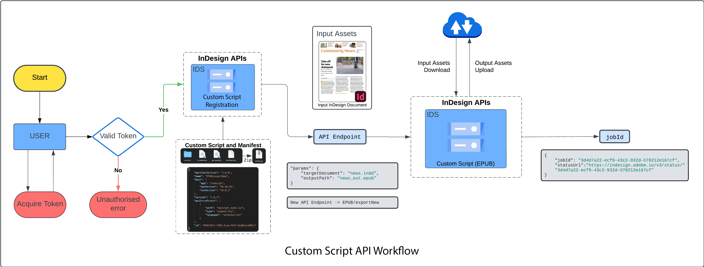
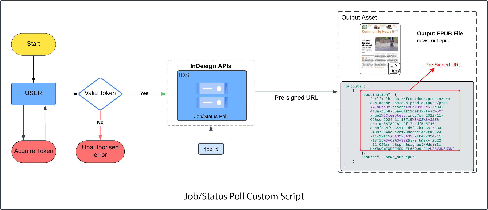

# Working with the Custom Scripts API

With the Custom Scripts API, register [custom scripts bundle that you've created][1] with the API.
Then use those custom scripts on documents by referencing the `{SCRIPT_ID}` and `{SCRIPT_NAME}`.

## Before you start

- You'll need [a valid access token and client ID][2].

In the cURL commands, be sure to:

-  Update the `Authorization` with the bearer access token.
-  Update `x-api-key` with the client ID.
-  Update `x-gw-ims-org-id` with your organization ID.
  
## Register a custom script



New custom scripts get registered by making a POST call to the API.

### Quickstart

Use this cURL command to register a custom script.
Be sure to update the `{YOUR_CUSTOM_SCRIPT_ZIP}` with the [path to your custom script][3].

```curl
curl --request POST \
--url https://indesign.adobe.io/v3/scripts \
--header 'Authorization: Bearer {YOUR_OAUTH_TOKEN}' \
--header 'x-api-key: {YOUR_API_KEY}' \
--header 'Content-Type: multipart/form-data' \
--header 'x-gw-ims-org-id: {YOUR_ORG_ID}' \
--form file=@{YOUR_CUSTOM_SCRIPT_ZIP}
```

In the response, you'll receive a url which contains `{SCRIPT_ID}` and `{SCRIPT_NAME}`.

**Example response**

```json
{
  "url": "https://indesign.adobe.io/v3/{SCRIPT_ID}/{SCRIPT_NAME}",
  "capability": "sample-execution",
  "version": "1.0.0"
}
```

## Execute a custom script



Assets specified in the execution request are downloaded on the
local file system using the specified identifiers. The custom script
should be authored to work against locally downloaded assets.

The execution request can include a JSON dictionary as a parameter.
The custom script defines the parameters and passes as is
to it during execution

The generated output uploads to the target location. If no location is provided,
the assets upload to temporary storage.

Each execution request is an asynchronous operation for which the status can be
fetched using the [Status API][4]. A link with expiry is provided in the execution status.

### Quickstart

Use this cURL command to run a custom script on a document.

```curl
curl --request POST \
--url https://indesign.adobe.io/v3/{SCRIPT_ID}/{SCRIPT_NAME} \
--header 'Authorization: Bearer {YOUR_OAUTH_TOKEN}' \
--header 'Content-Type: application/json' \
--header 'x-api-key: {YOUR_API_KEY}' \
--header 'x-gw-ims-org-id: {YOUR_ORG_ID}' \
--data-raw '{
  "assets": [
    {
      "source": {
        "url": "{YOUR_PRE-SIGNED_URL}"
      },
      "destination": "sample.indd"
    }
  ],
  "params": {
    "targetDocument": "sample.indd",
    "outputPath": "converted.idml"
  },
}'
```

The raw data may include three
parts:

- **assets** - Input assets for the request.
- **params** - Information about what to do with the input assets.
- **outputs** - Specify locations where the output assets are uploaded. Without an `outputs` parameter, the output assets are stored in a temporary
repository, and a [pre-signed URL][5] will be shared for those assets, which will be valid for 24hrs.

Consult this skeleton [cURL request][6] for more details.

**Example response**

```json
{ 

"jobId": "9b9d00c5-8659-4766-8430-ed0a1c9bd87d", 

"statusUrl": "https://indesign.adobe.io/v3/status/9b9d00c5-8659-4766-8430-ed0a1c9bd87d" 

} 
```

[1]: ../writing-scripts-for-custom-scripts-api/
[2]: ../../getting_started/index.md#Access-tokens
[3]: ../writing-scripts-for-custom-scripts-api/
[4]: ../../api/
[5]: ../../getting_started/concepts/index.md#Pre-signed-URLs
[6]: https://developer.adobe.com/commerce/webapi/get-started/gs-curl/
