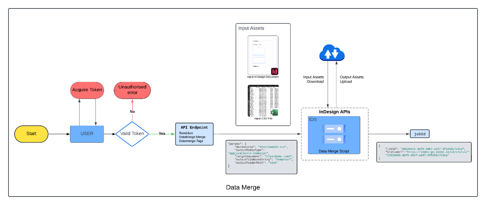

# Working with the Data Merge API



Data merge generates variations of a template document
from data in a provided CSV file.

The Data Merge API supports UTF-16BE encoding for CSV files, which is necessary for languages or characters requiring multi-byte representation. For plain English characters, the CSV will function correctly even without this encoding.

The [Data Merge API](../../api/) includes two components to complete the task: the data merge and the data merge tags.

## Quickstart

The example below takes the data from `Directory_Names.csv` and creates different variations of `dataMergeTemplate.indd`. The
output is a merged INDD file of all variations.

### Merge data

This cURL command merges the data (from `Directory_Names.csv` into `dataMergeTemplate.indd`).

```curl
curl --location --request POST 'https://indesign.adobe.io/v3/merge-data' \
--header 'Authorization: Bearer {YOUR_OAUTH_TOKEN}' \
--header 'x-api-key: {YOUR_API_KEY}' \
--header 'Content-Type: application/json' \
--data-raw '{
  "assets": [
    {
      "source": {
        "url": "{PRE-SIGNED_URL}",
        "storageType": "Azure"
      },
      "destination": "dataMergeTemplate.indd"
    },
    {
      "source": {
        "url": "{PRE-SIGNED_URL}",
        "storageType": "Azure"
      },
      "destination": "Directory_Names.csv"
    }
  ],
  "params": {
    "targetDocument": "dataMergeTemplate.indd",
    "outputMediaType": "application/x-indesign",
    "outputFolderPath": {OUTPUT_FOLDER_PATH},
    "outputFileBaseString": "merged",
    "dataSource": "Directory_Names.csv",
    "hyphenationSettings": {
      "afterFirst": 3,
      "beforeLast": 3,
      "wordsLongerThan": 6,
      "ladderLimit": 2,
      "zone": 0.15,
      "capitalizedWords": false,
      "lastWord": true,
      "acrossColumns": false,
      "dictionarySettings": [
        {
          "language": "English: USA",
          "wordList": ["~word1", "ex~word2"]
        },
        {
          "language": "English: UK",
          "wordList": ["~word3", "~word4"]
        }
      ]
    }
  },
  "outputs": [
    {
      "destination": {
        "url": "{PUT-SIGNED_URL}"
      },
      "source": "{OUTPUT_FOLDER_PATH}/merged-1.pdf"
    }
  ]
}'
```

The raw data may include three
parts:

- **assets** - Input assets for the request.
- **params** - Information about what to do with the input assets.
- **outputs** - Specify locations where the output assets are uploaded. Without an `outputs` parameter, the output assets are stored in a temporary
repository, and a [pre-signed URL](/indesign-apis/concepts/#pre-signed-urls) will be shared for those assets, which will be valid for 24hrs.

Consult this skeleton [cURL request](https://developer.adobe.com/commerce/webapi/get-started/gs-curl/) for more details.

### Output Path Variations in Data Merge API

When using the Data Merge API, the output file paths are determined by the `outputFolderPath` and `outputFileBaseString` parameters in the request. Here are the different scenarios and their corresponding output paths:

#### Case 1: Both Parameters Missing

When neither `outputFolderPath` nor `outputFileBaseString` is provided:

- Output is created in a temporary folder with a random number prefix (e.g. tmp0696)
- The output filename is derived from the original document filename

Example:

- Source: `Template.indd`
- Output: `tmp0696/range1/Template.indd`
- In case of multiple output documents/pdf:
  - `tmp0696/range1/Template.indd`
  - `tmp0696/range2/Template.indd`
  - `tmp0696/range1/Template.pdf`
  - `tmp0696/range2/Template.pdf`
- For PNG/JPEG outputs:
  - `tmp0696/range1/Template.png`
  - `tmp0696/range1/Template2.png`
  - `tmp0696/range1/Template3.png`

#### Case 2: Only outputFileBaseString Provided

When only `outputFileBaseString` is specified:

- Output is created in a temporary folder with a random number prefix (e.g. tmp0696)
- Filename uses the provided base string

Example:

- Source: `Template.indd`
- `outputFileBaseString`: "MergedOutput"
- Output: `tmp0696/range1/MergedOutput.indd`
- In case of multiple output documents/pdf:
  - `tmp0696/range1/MergedOutput.indd`
  - `tmp0696/range2/MergedOutput.indd`
  - `tmp0696/range1/MergedOutput.pdf`
  - `tmp0696/range2/MergedOutput.pdf`
- For PNG/JPEG outputs:
  - `tmp0696/range1/MergedOutput.png`
  - `tmp0696/range1/MergedOutput2.png`
  - `tmp0696/range1/MergedOutput3.png`

#### Case 3: Only outputFolderPath Provided

When only `outputFolderPath` is specified:

- Output is created in the specified folder
- Filename is derived from the original template

Example:

- Source: `Template.indd`
- `outputFolderPath`: "ResultFolder"
- Output: `ResultFolder/range1/Template.indd`
- In case of multiple output documents/pdf:
  - `ResultFolder/range1/Template.indd`
  - `ResultFolder/range2/Template.indd`
  - `ResultFolder/range1/Template.pdf`
  - `ResultFolder/range2/Template.pdf`
- For PNG/JPEG outputs:
  - `ResultFolder/range1/Template.png`
  - `ResultFolder/range1/Template2.png`
  - `ResultFolder/range1/Template3.png`

#### Case 4: Both Parameters Provided

When both parameters are specified:

- Output is created in the specified folder
- Filename uses the provided base string

Example:

- Source: `Template.indd`
- `outputFileBaseString`: "MergedOutput"
- `outputFolderPath`: "ResultFolder"
- Output: `ResultFolder/range1/MergedOutput.indd`
- In case of multiple output documents/pdf:
  - `ResultFolder/range1/MergedOutput.indd`
  - `ResultFolder/range2/MergedOutput.indd`
  - `ResultFolder/range1/MergedOutput.pdf`
  - `ResultFolder/range2/MergedOutput.pdf`
- For PNG/JPEG outputs:
  - `ResultFolder/range1/MergedOutput.png`
  - `ResultFolder/range1/MergedOutput2.png`
  - `ResultFolder/range1/MergedOutput3.png`

#### Note:

- When generating multiple documents or different output formats (PNG/JPEG), a subfolder is created for each range, such as range1, range2, range3, etc., to maintain organized and unique filenames.
- The rangeX subfolders (e.g. range1, range2, etc.) are created based on the `pagesPerDocument` value defined in the request. For example, if `pagesPerDocument` is set to 10 and the total number of records for the data merge is 20, then two folders—range1 and range2—will be generated. These will contain the output for record ranges 1–10 and 11–20, respectively.
- The number and type of output files within each rangeX folder depends on the selected `outputMediaType`:
  - If `outputMediaType` is `application/x-indesign`, or `application/pdf`, each rangeX folder will contain one InDesign document/pdf.
  - If `outputMediaType` is `image/png` or `image/jpeg`, each rangeX folder will contain multiple image files, corresponding to each record in that range (e.g., 10 images for 10 records).

### Retrieve data merge tags

This cURL command retrieves the data merge tags from the document.

```curl
curl --location --request POST 'https://indesign.adobe.io/v3/merge-data-tags' \
--header 'Authorization: Bearer {YOUR_OAUTH_TOKEN}' \
--header 'x-api-key: {YOUR_API_KEY}' \
--header 'Content-Type: application/json' \
--data-raw '{
  "assets": [
    {
      "source": {
        "url": "{PRE-SIGNED_URL}",
        "storageType": "Azure"
      },
      "destination": "dataMergeTemplate.indd"
    },
    {
      "source": {
        "url": "{PRE-SIGNED_URL}",
        "storageType": "Azure"
      },
      "destination": "batang.ttc"
    }
  ],
  "params": {
    "outputMediaType": "application/x-indesign",
    "targetDocument": "dataMergeTemplate.indd",
    "includePageItemIdentifiers": true
  }
}'
```
